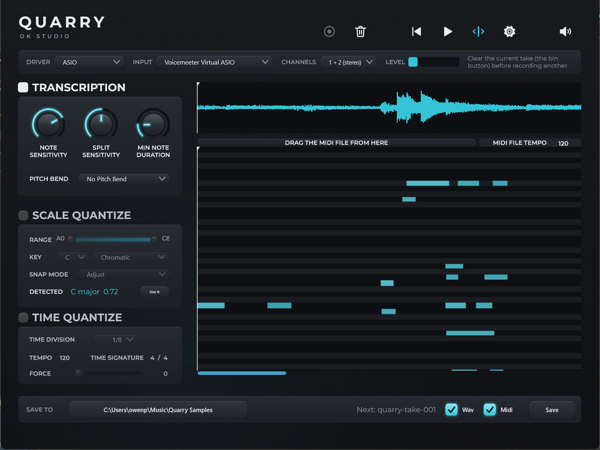

# Quarry 

Quarry is the audio plugin that brings **state-of-the-art Audio to MIDI conversion** into
your favorite Digital Audio Workstation.

> Quarry is a fork of [NeuralNote](https://github.com/DamRsn/NeuralNote) by Damien Ronssin and
> Tibor Vass, extending it with video-assisted transcription. The transcription engine is their work;
> see [Credits](#credits). Both projects are Apache-2.0 licensed.

- Works with any tonal instrument (voice included)
- Supports polyphonic transcription
- Supports pitch bend detection
- Lightweight and very fast transcription
- Allows to adjust the parameters while listening to the transcription
- Allows to scale and time quantize transcribed MIDI directly in the plugin

## Install Quarry

Download the latest release for your platform [here](https://github.com/owenpkent/Quarry/releases) (Windows,
macOS (Universal) and Linux supported)!

Installers are available for both Windows and Mac, including Standalone, VST3, and AU (Mac only) versions. The
installers allow users to select which format(s) they want to install. On macOS, the code is signed, while on Windows,
it is not. This means you may need to take a few additional steps to use Quarry on Windows.

For Linux, raw binaries are provided for VST3 and Standalone. You can install them by copying the files to the
appropriate locations.

## Usage



Quarry comes as a simple AudioFX plugin (VST3/AU/Standalone app) to be applied on the track to transcribe.

The workflow is very simple:

- Gather some audio
    - Click record. Works when recording for real or when playing the track in a DAW.
    - Or, in the standalone app, pick an audio input in the **SOURCE** strip and record straight from it
      (see below).
    - Or drop an audio file on the plugin. (.wav, .aiff, .flac, .mp3 and .ogg (vorbis) supported)
- Quarry says what it heard: the key and its runner-up, the tempo, the meter, how many notes,
  and a strip showing which bars the model was least sure of. Click a bar to jump there, or press
  **NEXT SHAKY BAR** to walk them. **show notes** puts the piano roll under the waveform when you
  want to see the notes themselves.
- Listen to the result by clicking the play button.
    - Play with the different settings to adjust the transcription, even while listening to it
    - Individually adjust the level of the source audio and of the synthesized transcription
- Once you're satisfied, keep it: drag the MIDI straight into a track, or use the **SAVE TO** bar along the
  bottom to write the audio and the transcription to a folder. Both write to the same place, the folder named
  in **SAVE TO**, so a dragged transcription stays there afterwards rather than vanishing with the session. It
  defaults to `Quarry Samples` under your music folder; change it once in **SAVE TO** and the drag follows.

### Recording from an audio input

The **SOURCE** strip sits under the toolbar, always on screen: what Quarry is about to record is not something
you should have to open a panel to check. In the standalone app it records straight from this computer's audio
hardware, with no DAW and no trip through the Audio/MIDI Settings dialog:

- **DRIVER** picks the audio driver to list inputs from. On Windows the first entry is **System Audio**, whose
  inputs are the computer's playback outputs rather than its microphones (see below). The rest are the real
  drivers (Windows Audio, DirectSound, ...). Quarry does not build with ASIO.
- **INPUT** picks what to record. `Host input (no device)` is the original NeuralNote behaviour: record whatever
  audio the DAW sends the plugin. Anything else is a device Quarry opens itself, kept separate from the
  standalone app's own audio setup, so choosing one never disturbs it.
- **CHANNELS** picks which channel(s) of a multi-input interface to record.
- **LEVEL** shows the input's level, so you can see signal arriving before you commit to a take.

Picking a device is standalone-only. Loaded in a DAW, Quarry never opens an audio device of its own: the strip
hides those three pickers and shows only the level and what it is recording, and recording uses the audio the
host sends the plugin, exactly as it always did. A device the plugin opened for itself is a device the host
could lose, and the host's own device is the one the user already chose.

Recording then works as it always did: hit record in the toolbar, play, hit stop, and the transcription
appears. The chosen input is remembered between runs.

To transcribe audio that is *playing* on this computer (a video in a browser, say) rather than audio coming in
a microphone, pick the **System Audio** driver and then the output you are listening on. Quarry records
everything coming out of it, through WASAPI loopback, so no "Stereo Mix" input and no virtual audio cable is
needed. That is Windows only: on macOS and Linux the driver list holds only the real drivers, and a loopback
input your sound card offers, or a virtual audio cable, is still the way there.

On Windows the standalone app starts on System Audio, pointed at the default playback output, so there is
nothing to set up before hitting record; elsewhere it starts on this computer's default input. The standalone
has no host input at all: it declares no input bus, because everything it records comes through the device
picked here.

### Keeping a take

The **SAVE TO** bar along the bottom writes the finished take to a folder you pick once. Two toggles choose
what gets written, the audio and the transcription, and both are on by default. The name of the next take is
shown before you commit to it: a dropped file keeps its own name so the saved copy sits beside its source, and
a recording takes the next free `quarry-take-NNN`. Both files of a take always share one name, and nothing is
ever overwritten. A dropped file that is not already a wav is decoded and written out as one, so what lands in
the folder is a file that opens.

The folder and the two toggles are saved with the project, so a session reopened another day writes where it
wrote before.

### What key is this in

**SCALE QUANTIZE** is an instruction: it snaps the transcription to a key you choose. **DETECTED**, on the row
below, is the opposite, a reading of what Quarry actually heard, with a number beside it saying how strongly
the notes fit. It reads the transcription as the model produced it, not what scale quantize left behind, so
switching quantize on cannot make the reading agree with the key you set. A clear tonal phrase scores around
0.95; anything below 0.5, or a take whose notes sit in too few pitch classes to be a key at all, reports
`no clear key` instead of naming one. **Use it** copies the detected key into the snap controls.

**Watch the original NeuralNote presentation video for the Neural Audio Plugin
competition [here](https://www.youtube.com/watch?v=6_MC0_aG_DQ)**.

Quarry uses internally the model from Spotify's [basic-pitch](https://github.com/spotify/basic-pitch). See
their [blogpost](https://engineering.atspotify.com/2022/06/meet-basic-pitch/)
and [paper](https://arxiv.org/abs/2203.09893) for more information. In Quarry, basic-pitch is run
using [RTNeural](https://github.com/jatinchowdhury18/RTNeural) for the CNN part
and [ONNXRuntime](https://github.com/microsoft/onnxruntime) for the feature part (Constant-Q transform calculation +
Harmonic Stacking).
As part of the original NeuralNote project, its authors
[contributed to RTNeural](https://github.com/jatinchowdhury18/RTNeural/pull/89) to add 2D convolution support.

## Sampling one application

Quarry opens on **SAMPLE**, which captures audio in the first place rather than converting it.
Transcribe is still where a take becomes MIDI; it is somewhere a capture takes you, and
**< SAMPLES** in the toolbar is the way back.

It lists **every window you have open**, one row each, with whatever is making a sound right now
sorted to the top and metered. Type in the filter box to narrow it. You do not have to wait for a
tab to start playing before you can arm it: process loopback records a silent target quite happily,
so pick the window first and press play afterwards. Quarry records the one you pick **in
isolation**. Not the speakers, the application: a browser tab and nothing else, no
notification arriving halfway through, no second app bleeding in. Because the capture follows
that process rather than the output, focus does not matter. Arm the tab, hit record, switch to
the browser, play it, switch back, stop. Nothing you did in between is in the file, and the
silence at the end is trimmed off anyway.

**Two browser windows are two rows**, told apart by what each is showing. They are one process
underneath, so this is about naming the capture correctly rather than separating the sound:
picking the window is the only way anything can know which of them you meant.

This is Windows 10 build 20348 and later; the page hides itself elsewhere. **Everything this
computer plays** sits at the top of the list as the fallback, and says plainly that its source
can only be guessed at.

### What a capture knows about itself

The application, the window title, the browser tab's URL and a picture of the window at the
moment you started. Written into the wav where the format has somewhere to put it, and in full
to a `.json` beside it.

The sidecar is the record. There is no database, which means the folder is the truth: delete a
sample in Explorer and it is gone from the browser too, with nothing left over pointing at a
file that is not there.

**Everything mode gathers none of that**, on purpose. There, the loudest thing playing is only a
guess at what you meant, and reading the address bar of a window you never picked, or
photographing it, is not something "record everything the computer plays" asked for. It records
the application's name and stops.

### Volume is the one thing you cannot fix later

Loopback captures **after** an application's own volume slider, so a tab at 50% is 6 dB of loss
baked permanently into the file. No format recovers it. The list says so in orange next to any
app below 100%, and a button to set it back appears when there is something to set back, which
is the only time it means anything.

### What lands on disk

32-bit float wav, exactly as the audio arrived: no conversion, no dither, and no decision to
make about peaks above 0 dBFS. Silence is trimmed from both ends and the crop written down.
Peak, true peak and integrated loudness are measured and recorded, and applied to nothing.

Files go to dated folders under a captures folder you pick once, named for the time, the
application and what it was playing: `2026-08/2026-08-16/141901-chrome-silence-youtube.wav`.

### Finding one again

The right-hand half of the page is everything captured so far, browsed the way it is stored: a
month, then a day, then the takes, with a row back up. Each says when it was taken, what the
window was showing, and how long it runs.

One search box, matched against the name, the application, the window title, the URL and the
tags at once, because knowing which of those your memory of a sample lives in is not a
reasonable thing to ask. Several words narrow, and searching looks through every folder rather
than the one you are standing in. **TRANSCRIBE** hands a capture to the other page, which is
also how you listen to one, and deleting moves a file to the recycle bin rather than destroying
it.

**Turn it off** and the window shrinks to the source picker, which becomes a dropdown: Quarry
folds down to a small capture tool that records and gets out of the way. It reopens the way you
left it.

## Build from source

### Windows: the quick loop

Double-click `run.py` (or `py run.py`). It builds the standalone app and launches it, fetching
the submodules and the prebuilt onnxruntime on a fresh clone. `py run.py --no-build` just
relaunches what is already built. Most work can be tried there: the standalone records from this
computer's own audio hardware, so no DAW is needed.

`run.py` configures with `-DLTO=OFF`. The prebuilt `onnxruntime.lib` is compiled with `/GL` by a
specific MSVC version, so with link-time optimisation on, linking fails with `C1047` unless your
compiler matches the one it was built with. `build.bat` (below) does not pass that flag, so it
only works on a matching toolchain.

### Full build

Requirements are: `git`, `cmake`, and your OS's preferred compiler suite. Nothing else has to be fetched by
hand: the okstudio kit headers Quarry uses are checked in under
[`ThirdParty/okstudio`](ThirdParty/okstudio/README.md). They carry both the system-audio recording on Windows
and the Obsidian look and feel the whole window is drawn in, so they are needed on every platform, not only
where loopback recording works.

Use this when cloning:

```
git clone --recurse-submodules --shallow-submodules https://github.com/owenpkent/Quarry
 ```

The following OS-specific build scripts have to be executed at least once before being able to use the project as a
normal CMake project. The script downloads onnxruntime static library (created by the NeuralNote authors
with [ort-builder](https://github.com/olilarkin/ort-builder)) before calling CMake.

#### macOS

```
$ ./build.sh
```

#### Windows

Due to [a known issue](https://github.com/DamRsn/NeuralNote/issues/21), if you're not using Visual Studio 2022 (MSVC
version: 19.35.x, check `cl` output), then you'll need to manually build onnxruntime.lib like so:

1. Ensure you have Python installed; if not, download at https://www.python.org/downloads/windows/ (this does not
   currently work with Python 3.11, prefer Python 3.10).

2. Execute each of the following lines in a command prompt:

```
git clone --depth 1 --recurse-submodules --shallow-submodules https://github.com/tiborvass/libonnxruntime-neuralnote ThirdParty\onnxruntime
cd ThirdParty\onnxruntime
python3 -m venv venv
.\venv\Scripts\activate.bat
pip install -r requirements.txt
.\convert-model-to-ort.bat model.onnx
.\build-win.bat model.required_operators_and_types.with_runtime_opt.config
copy model.with_runtime_opt.ort ..\..\Lib\ModelData\features_model.ort
cd ..\..
```

Now you can get back to building Quarry as follows:

```
> .\build.bat
```

#### IDEs

Once the build script has been executed at least once, you can load this project in your favorite IDE
(CLion/Visual Studio/VSCode/etc) and click 'build' for one of the targets.

### Measuring the transcription

Changing the analysis engine without measuring it is guesswork, so there is a bench. It scores the
real engine, through the real preprocessing, against reference MIDI.

```
cmake -S . -B build -DQUARRY_BUILD_BENCH=ON
cmake --build build --target Bench --config Release
py tools/bench/make_corpus.py Tests/bench_corpus
build/tools/bench/Bench_artefacts/Release/Bench.exe Tests/bench_corpus --baseline tools/bench/baseline.tsv
```

It reports note-level precision, recall and F1 at the standard 50 ms onset tolerance three ways
(onset, onset and offset, onset and velocity) plus mean onset error, and exits non-zero if the
aggregate has fallen against the committed baseline. `--legacy` runs the engine as it stood before
the current round of fixes, so a difference can be attributed to a change rather than to the
corpus. `--write-baseline <file>` records a new one.

`make_corpus.py` generates a synthetic piano corpus with exact ground truth so the bench is
runnable immediately, and it is a starting point rather than a substitute: the notes are struck by
an additive synth with no pedal, no sympathetic resonance and no room, so scores on it are an upper
bound. Real material goes in the same directory, as matching `<name>.wav` and `<name>.mid` pairs.
`Tests/bench_corpus/` is not tracked, since it regenerates deterministically.

Unit tests, including the ten cases checking this port against basic-pitch's own Python
implementation, build with `-DBUILD_UNIT_TESTS=ON`.

## Reuse code from Quarry’s transcription engine

All the code to perform the transcription is in `Lib/Model` and all the model weights are in `Lib/ModelData/`. Feel free
to use only this part of the code in your own project! It may be isolated further from the rest of the repo and made
into a library in the future.

The code to generate the files in `Lib/ModelData/` is not currently available as it required a lot of manual operations.
But here's a description of the process the NeuralNote authors followed to create those files:

- `features_model.onnx` was generated by converting a keras model containing only the CQT + Harmonic Stacking part of
  the full basic-pitch graph using `tf2onnx` (with manually added weights for batch normalization).
- the `.json` files containing the weights of the basic-pitch cnn were generated from the tensorflow-js model available
  in the [basic-pitch-ts repository](https://github.com/spotify/basic-pitch-ts), then converted to onnx with `tf2onnx`.
  Finally, the weights were gathered manually to `.npy` thanks to [Netron](https://netron.app/) and finally applied to a
  split keras model created with [basic-pitch](https://github.com/spotify/basic-pitch) code.

The original basic-pitch CNN was split in 4 sequential models wired together, so they can be run with RTNeural.

## Bug reports and feature requests

If you have any request/suggestion concerning the plugin or encounter a bug, please file a GitHub issue.

## Contributing

Contributions are most welcome! If you want to add some features to the plugin or simply improve the documentation,
please open a PR!

## License

Quarry software and code is published under the Apache-2.0 license. See the [license file](LICENSE).

#### Third Party libraries used and license

Here's a list of all the third party libraries used in Quarry and the license under which they are used.

- [JUCE](https://juce.com/) (JUCE Starter)
- [RTNeural](https://github.com/jatinchowdhury18/RTNeural) (BSD-3-Clause license)
- [ONNXRuntime](https://github.com/microsoft/onnxruntime) (MIT License)
- [ort-builder](https://github.com/olilarkin/ort-builder) (MIT License)
- [basic-pitch](https://github.com/spotify/basic-pitch) (Apache-2.0 license)
- [basic-pitch-ts](https://github.com/spotify/basic-pitch-ts) (Apache-2.0 license)
- [minimp3](https://github.com/lieff/minimp3) (CC0-1.0 license)
- [okstudio JUCE kit](https://github.com/owenpkent/okstudio-juce-kit) (OK Studio's own, used for Windows
  system-audio recording and for the Obsidian look and feel the window is drawn in; the headers are vendored,
  see [`ThirdParty/okstudio`](ThirdParty/okstudio/README.md))

## Could Quarry transcribe audio in real-time?

Unfortunately no and this for a few reasons:

- Basic Pitch uses the Constant-Q transform (CQT) as input feature. The CQT requires really long audio chunks (> 1s) to
  get amplitudes for the lowest frequency bins. This makes the latency too high to have real-time transcription.
- The basic pitch CNN has an additional latency of approximately 120ms.
- The note events creation algorithm processes the posteriorgrams backward (from future to past) and is hence
  non-causal.

But if you have ideas please share!

## Credits

Quarry is maintained by [Owen Kent](https://github.com/owenpkent).

It is a fork of [NeuralNote](https://github.com/DamRsn/NeuralNote), which was developed by
[Damien Ronssin](https://github.com/DamRsn) and [Tibor Vass](https://github.com/tiborvass), with the original
plugin user interface designed by Perrine Morel. The audio-to-MIDI transcription engine that Quarry is built
on is their work. Quarry's window has since been redrawn onto the OK Studio look and feel, but the layout it
started from was theirs.

#### Contributors

Many thanks to the contributors!

- [jatinchowdhury18](https://github.com/jatinchowdhury18): File browser.
- [trirpi](https://github.com/trirpi)
    - More scale options in `SCALE QUANTIZE`.
    - Horizontal zoom for the audio waveform and the piano roll.
- [polygon](https://github.com/polygon) and [SamuMazzi](https://github.com/SamuMazzi): Linux support.